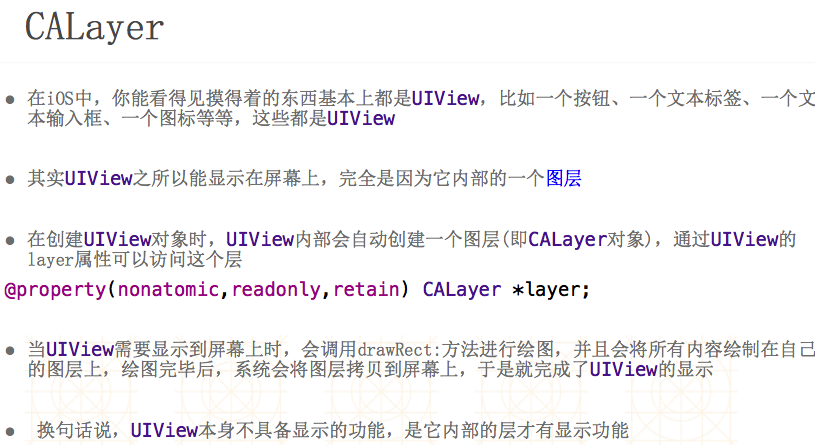
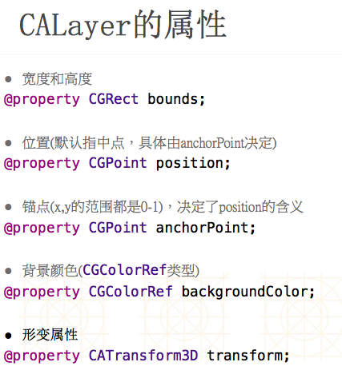
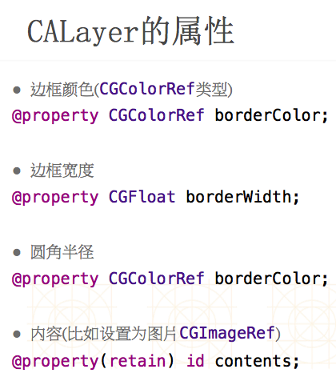
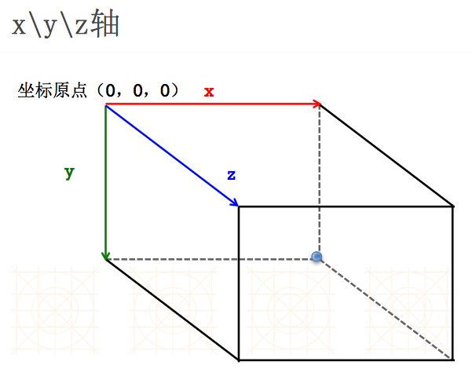
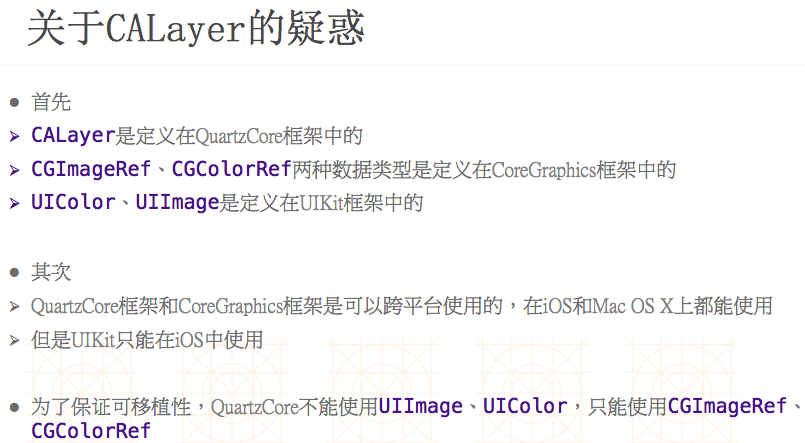
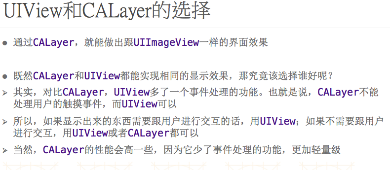
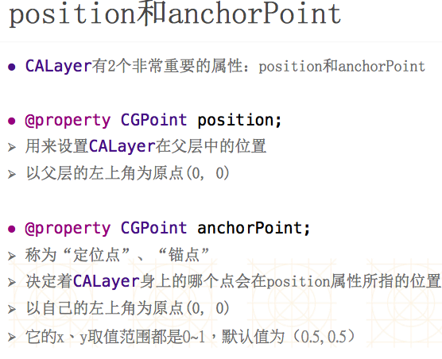
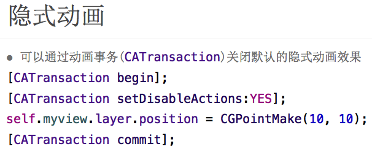
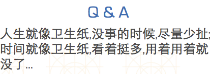

# CALayer


---

-------

-------

-------

-------

-------

-------

-------

-------



## `layer基本`

```objc

- (void)viewLayer
{
    // 设置阴影
    // Opacity：不透明度
    _redView.layer.shadowOpacity = 1;
    //    _redView.layer.shadowOffset = CGSizeMake(10, 10);
    // 注意：图层的颜色都是核心绘图框架，通常。CGColor
    _redView.layer.shadowColor = [UIColor yellowColor].CGColor;
    _redView.layer.shadowRadius = 10;


    // 圆角半径
    _redView.layer.cornerRadius = 50;

    // 边框
    _redView.layer.borderWidth = 1;
    _redView.layer.borderColor = [UIColor whiteColor].CGColor;
}

```

## `imageViewLayer`

```objc
- (void)imageLayer
{
    // cornerRadiu设置控件的主层边框
    _imageView.layer.cornerRadius = 50;

    NSLog(@"%@",_imageView.layer.contents)
    ;
    // 超出主层边框的内容全部裁

    _imageView.layer.masksToBounds = YES;

    // 设置边框
    _imageView.layer.borderColor = [UIColor whiteColor].CGColor;
    _imageView.layer.borderWidth = 1;

    // 如何判断以后是否需要裁剪图片，就判断下需要显示图层的控件是否是正方形。
}

```

## `图层形变`

```objc
    // 图层形变
    // 缩放
    [UIView animateWithDuration:1 animations:^{

//        _redView.layer.transform = CATransform3DMakeRotation(M_PI, 1, 1, 0);
//        _redView.layer.transform = CATransform3DMakeScale(0.5, 0.5, 1);

        // 快速进行图层缩放,KVC
        // x,y同时缩放0.5m
//        [_redView.layer setValue:@0.5 forKeyPath:@"transform.scale"];

        [_redView.layer setValue:@(M_PI) forKeyPath:@"transform.rotation"];

    }];

```

## `layer的图层内容`

```objc
    // 创建图层
    CALayer *layer = [CALayer layer];

    layer.frame = CGRectMake(50, 50, 200, 200);

    layer.backgroundColor = [UIColor redColor].CGColor;

    // 设置图层内容
    layer.contents = (id)[UIImage imageNamed:@"阿狸头像"].CGImage;


    [self.view.layer addSublayer:layer];

```

## `layer的隐式动画`
- uikit的控件的layer修改属性后没有动画, 控件的layer属于rootlayer.
- 自己手动创建的layer属于非rootlayer, 修改属性后自动有动画

# clock

```objc
#import "LMJClockView.h"

#define keyPath(obj, key) @(((void)obj.key, #key))
#define angle2Radion(angle) ((angle) / 180.0 * M_PI)

// 一秒钟秒针转6°
#define perSecondA 6.0
// 一分钟分针转6°
#define perMinuteA 6.0
// 一小时时针转30°
#define perHourA 30.0
// 每分钟时针转多少度
#define perMinuteHourA (perHourA/60.0)
// 每秒钟时针转多少度
#define perSecondHourA (perHourA/3600.0)
// 每秒钟分针赚多少度
#define perSecondMinuteA (perMinuteA/60.0)

@interface LMJClockView ()

@property (weak, nonatomic) CALayer *secondLayer;
@property (weak, nonatomic) CALayer *minuteLayer;
@property (weak, nonatomic) CALayer *hourLayer;

@end

@implementation LMJClockView

- (void)drawRect:(CGRect)rect
{
    [[UIImage imageNamed:@"钟表"] drawInRect:rect];
}
- (void)setUp
{
    [self setUpHourLayer];
    [self setUpMinuteLayer];
    [self setUpSecondLayer];

    [self timeChange];

    CADisplayLink *link = [CADisplayLink displayLinkWithTarget:self selector:@selector(timeChange)];
    [link addToRunLoop:[NSRunLoop mainRunLoop] forMode:NSDefaultRunLoopMode];
}

- (void)setUpHourLayer
{
    CALayer *layer = [CALayer layer];
    self.hourLayer = layer;
    [self.layer addSublayer:layer];
    layer.anchorPoint = CGPointMake(0.5, 0.95);
    layer.backgroundColor = [UIColor blackColor].CGColor;
}
- (void)setUpMinuteLayer
{
    CALayer *layer = [CALayer layer];
    self.minuteLayer = layer;
    [self.layer addSublayer:layer];
    layer.anchorPoint = CGPointMake(0.5, 0.95);
    layer.backgroundColor = [UIColor blackColor].CGColor;
}
- (void)setUpSecondLayer
{
    CALayer *layer = [CALayer layer];
    self.secondLayer = layer;
    [self.layer addSublayer:layer];
    layer.anchorPoint = CGPointMake(0.5, 0.95);
    layer.backgroundColor = [UIColor redColor].CGColor;
}

- (void)timeChange
{
    //1获取日历对象
    NSCalendar *calendar = [NSCalendar currentCalendar];

    // 2日历组件
    NSCalendarUnit units = NSCalendarUnitHour | NSCalendarUnitMinute | NSCalendarUnitSecond;
    NSDateComponents *cmps = [calendar components:units fromDate:[NSDate date]];

    // 3获取时间
    NSInteger second = cmps.second;
    NSInteger minute = cmps.minute;
    NSInteger hour = cmps.hour;

//    NSLog(@"%zd, %zd, %zd", second, minute, hour);

    //4计算每个指针需要旋转的角度
    CGFloat secondA = angle2Radion(second * perSecondA);
    CGFloat minuteA = angle2Radion(minute * perMinuteA + second * perSecondMinuteA);
    CGFloat hourA = angle2Radion(hour * perHourA + minute * perMinuteHourA + second * perSecondHourA);


    self.secondLayer.transform = CATransform3DMakeRotation(secondA, 0, 0, 1);
    self.minuteLayer.transform = CATransform3DMakeRotation(minuteA, 0, 0, 1);
    self.hourLayer.transform = CATransform3DMakeRotation(hourA, 0, 0, 1);
}

- (void)awakeFromNib
{
    [super awakeFromNib];
    [self setUp];
}

- (instancetype)initWithFrame:(CGRect)frame
{
    if(self = [super initWithFrame:frame])
    {
        [self setUp];
    }
    return self;
}

- (void)layoutSubviews
{
    [super layoutSubviews];
    UIImage *image = [UIImage imageNamed:@"钟表"];
    self.bounds = CGRectMake(0, 0, image.size.width, image.size.height);

    CGPoint center = [self.superview convertPoint:self.center toView:self];

    CGFloat w = self.bounds.size.width;

    self.secondLayer.position = center;
    self.hourLayer.position = center;
    self.minuteLayer.position = center;

    self.secondLayer.bounds = CGRectMake(0, 0, 1, w/2-20);
    self.secondLayer.cornerRadius = 1;

    self.minuteLayer.bounds = CGRectMake(0, 0, 4, w/2-26);
    self.minuteLayer.cornerRadius = 4;

    self.hourLayer.bounds = CGRectMake(0, 0, 7, w/2-40);
    self.hourLayer.cornerRadius = 7;
}
@end

```


