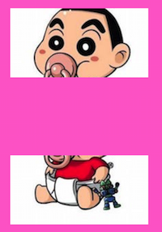
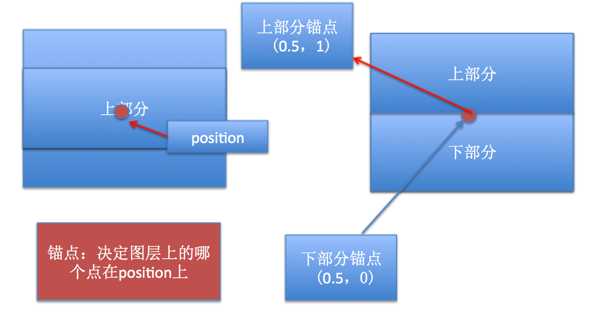

# Demo-2-FoldImage

- 注意里边的M34是负值
- 角度是逆时针


# 图片折叠效果

### 1.如何制作图片折叠效果？

`把一张图片分成两部分显示，上面一部分，下面一部分，折叠上面部分的内容。`


###2.如何把一张图片分成两部分显示。

搞两个控件，一个显示上半部分，一个显示下半部分，需要用到Layer(图层)的一个属性`contentsRect`,这个属性是可以控制图片显示的尺寸，可以让图片只显示上部分或者下部分，注意:`取值范围是0~1`.

CGRectMake(0, 0, 1, 0.5)   : `表示显示上半部分`

CGRectMake(0, 0.5, 1, 0.5) : `表示显示下半部分`

###3.如何快速的把两部分拼接成一张完整的图片。


3.1 首先了解折叠，折叠其实就是旋转，既然需要旋转就需要明确锚点，因为默认都是绕着锚点旋转的。

3.2 上部分内容绕着底部中心旋转，所以设置上部分的锚点为（0.5，1）

3.3 锚点设置好了，就可以确定位置了.

3.4 可以把上下部分重合在一起，然后分别设置上下部分的锚点，
上部分的锚点为`（0.5，1）`，下部分的锚点为`（0.5，0）`,就能快速重叠了。




###4.如何折叠上部分内容。
在拖动视图的时候，旋转上部分控件。修改`transform`属性。
- 可以在上部分和下部分底部添加一个拖动控件（`拖动控件尺寸就是完整的图片尺寸`），给这个控件添加一个pan手势，就能制造一个假象，拖动控件的时候，折叠图片。
- 计算Y轴每偏移一点，需要旋转多少角度，假设完整图片尺寸高度为200，当y = 200时，上部分图片应该刚好旋转180°，因此`angle = offsetY  * M_PI / 200`;
- 上部分内容应该是绕着X轴旋转，`逆时针旋转`，因此角度需要为负数。

```objc
 // 获取手指偏移量
    CGPoint transP = [sender translationInView:_containV];

// 初始化形变
    CATransform3D transform3D = CATransform3DIdentity;

// 设置立体效果
    transform3D.m34 = -1 / 1000.0;

// 计算折叠角度，因为需要逆时针旋转，所以取反
    CGFloat angle = -transP.y / 200.0 * M_PI;

    _topView.layer.transform = CATransform3DRotate(transform3D, angle, 1, 0, 0);

```
- 为了让折叠效果更加有效果，更加具有立体感，可以给形变设置m34属性，就能添加立体感。

```objc
// 设置M34就有立体感(近大远小)。 -1 / z ,z表示观察者在z轴上的值,z越小，看起来离我们越近，东西越大。
transform3D.m34 = -1 / 1000.0;
```

### 反弹效果
当手指抬起的时候，应该把折叠图片还原，其实就是把形变清空。
``` objc
   if (sender.state == UIGestureRecognizerStateEnded) { // 手指抬起
        // 还原
        [UIView animateWithDuration:0.5 delay:0 usingSpringWithDamping:0.1 initialSpringVelocity:3 options:UIViewAnimationOptionCurveEaseInOut animations:^{

            _topView.layer.transform = CATransform3DIdentity;

        } completion:nil];
    }
```

### 阴影效果
当折叠图片的时候，底部应该有个阴影渐变过程。

-  利用`CAGradientLayer`（渐变图层）制作阴影效果，添加到底部视图上，并且一开始需要隐藏，在拖动的时候慢慢显示出来。
-  颜色应是由`透明到黑色`渐变,表示阴影从无到有。

```objc
// 创建渐变图层
CAGradientLayer *shadomLayer = [CAGradientLayer layer];

// 设置渐变颜色
    shadomLayer.colors = @[(id)[UIColor clearColor],(id)[[UIColor blackColor] CGColor]];

    shadomLayer.frame = _bottomView.bounds;

    _shadomLayer = shadomLayer;

// 设置不透明度 0
    shadomLayer.opacity = 0;

    [_bottomView.layer addSublayer:shadomLayer];
```

-  在拖动的时候计算不透明度值，假设拖动200，阴影完全显示，不透明度应该为1，因此 opacity = y轴偏移量 * 1 /  200.0;

```objc

// 设置阴影不透明度
    _shadomLayer.opacity = transP.y * 1 /  200.0;

```
-  在手指抬起的时候，需要把阴影设置隐藏，不透明度为0；

```objc
 if (sender.state == UIGestureRecognizerStateEnded) { // 手指抬起
        // 还原
        [UIView animateWithDuration:0.5 delay:0 usingSpringWithDamping:0.1 initialSpringVelocity:3 options:UIViewAnimationOptionCurveEaseInOut animations:^{

            _topView.layer.transform = CATransform3DIdentity;

            // 还原阴影
            _shadomLayer.opacity = 0;


        } completion:nil];
    }
```


```objc
#import "ViewController.h"

@interface ViewController ()
@property (weak, nonatomic) IBOutlet UIImageView *topView;
@property (weak, nonatomic) IBOutlet UIImageView *bottomView;
@property (weak, nonatomic) IBOutlet UIView *dragView;

@property (nonatomic, weak) CAGradientLayer *gradientL;

@end

@implementation ViewController
// 一张图片必须要通过两个控件展示，旋转的时候，只旋转上部分控件
// 如何让一张完整的图片通过两个控件显示
// 通过layer控制图片的显示内容
// 如果快速把两个控件拼接成一个完整图片
- (void)viewDidLoad {
    [super viewDidLoad];
    // Do any additional setup after loading the view, typically from a nib.
    // 通过设置contentsRect可以设置图片显示的尺寸，取值0~1
    _topView.layer.contentsRect = CGRectMake(0, 0, 1, 0.5);
    _topView.layer.anchorPoint = CGPointMake(0.5, 1);

    _bottomView.layer.contentsRect = CGRectMake(0, 0.5, 1, 0.5);
    _bottomView.layer.anchorPoint = CGPointMake(0.5, 0);

    // 添加手势
    UIPanGestureRecognizer *pan = [[UIPanGestureRecognizer alloc] initWithTarget:self action:@selector(pan:)];

    [_dragView addGestureRecognizer:pan];

    // 渐变图层
    CAGradientLayer *gradientL = [CAGradientLayer layer];

    // 注意图层需要设置尺寸
    gradientL.frame = _bottomView.bounds;

    gradientL.opacity = 0;
    gradientL.colors = @[(id)[UIColor clearColor].CGColor,(id)[UIColor blackColor].CGColor];
    _gradientL = gradientL;
    // 设置渐变颜色
//    gradientL.colors = @[(id)[UIColor redColor].CGColor,(id)[UIColor greenColor].CGColor,(id)[UIColor yellowColor].CGColor];

    // 设置渐变定位点
//    gradientL.locations = @[@0.1,@0.4,@0.5];

    // 设置渐变开始点，取值0~1
//    gradientL.startPoint = CGPointMake(0, 1);

    [_bottomView.layer addSublayer:gradientL];

}

// 拖动的时候旋转上部分内容，200 M_PI
- (void)pan:(UIPanGestureRecognizer *)pan
{
    // 获取偏移量
   CGPoint transP = [pan translationInView:_dragView];

    // 旋转角度,往下逆时针旋转
    CGFloat angle = -transP.y / 200.0 * M_PI;
    CATransform3D transfrom = CATransform3DIdentity;
    // 增加旋转的立体感，近大远小,d：距离图层的距离
    transfrom.m34 = -1 / 500.0;

    transfrom = CATransform3DRotate(transfrom, angle, 1, 0, 0);

    _topView.layer.transform = transfrom;

    // 设置阴影效果
    _gradientL.opacity = transP.y * 1 / 200.0;

    if (pan.state == UIGestureRecognizerStateEnded) { // 反弹

        // 弹簧效果的动画
        // SpringWithDamping:弹性系数,越小，弹簧效果越明显
        [UIView animateWithDuration:0.6 delay:0 usingSpringWithDamping:0.2 initialSpringVelocity:10 options:UIViewAnimationOptionCurveEaseInOut animations:^{

            _topView.layer.transform = CATransform3DIdentity;

        } completion:^(BOOL finished) {

        }];
    }

}

@end

```


