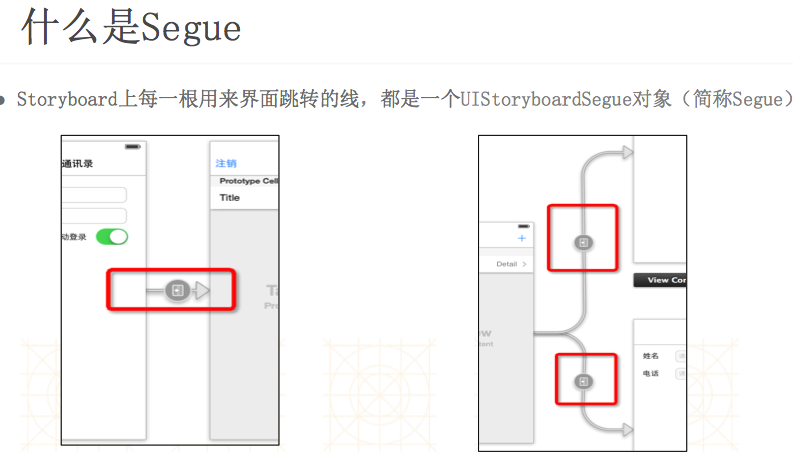
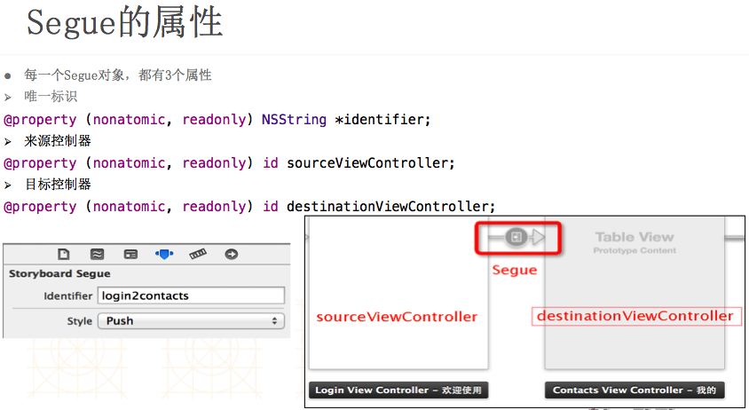
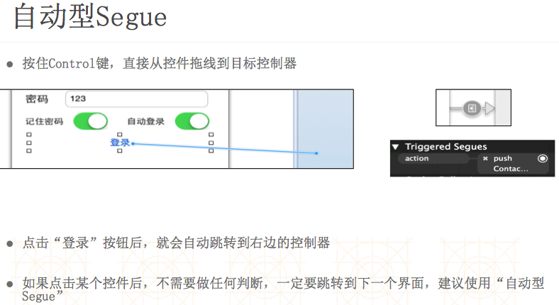
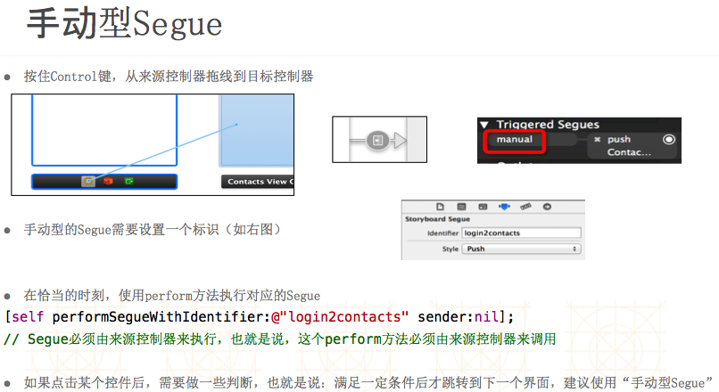
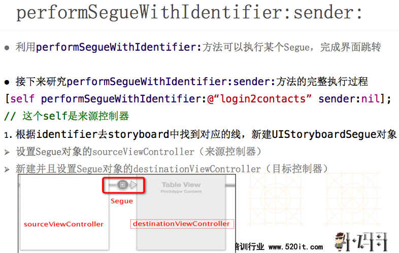
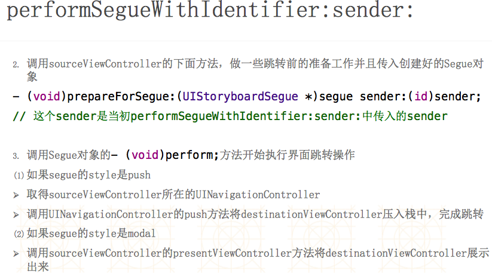
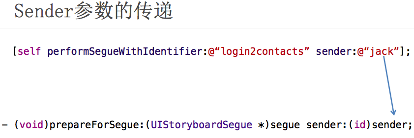

# segue

---

---

---

---

---

---

---

---


---


```objc
/*
 1.[self performSegueWithIdentifier]
 2.创建segue
 3.设置来源控制器segue.sourceViewController = self
 4.创建目的控制器，segue.destinationViewController = 目的控制器
 5.[self prepareForSegue]跳转之前的准备操作
 6.[segue perform]
 7.判断下segue的类型，如果是push,拿到导航控制器push
 [self.navigationController pushViewController:segue.destinationViewController animated:YES];
 */
@implementation XMGLoginViewController

// 在执行跳转之前的时候调用
- (void)prepareForSegue:(UIStoryboardSegue *)segue sender:(id)sender
{

    UIViewController *vc = segue.destinationViewController;
    vc.title = [NSString stringWithFormat:@"%@的联系人列表", _accountField.text];
    NSLog(@"%@--%@",segue.sourceViewController,segue.destinationViewController);
}

```
