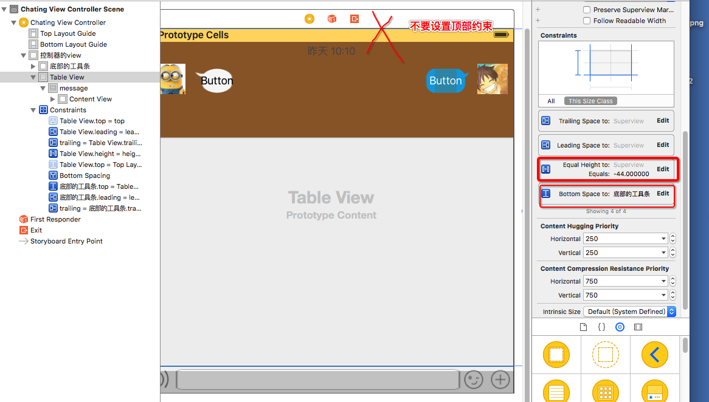

# Notification `通知`

### 通知(NSNotification)

```objc

一个完整的通知一般包含3个属性：
- (NSString *)name; // 通知的名称
- (id)object; // 通知发布者(是谁要发布通知)
- (NSDictionary *)userInfo; // 一些额外的信息(通知发布者传递给通知接收者的信息内容)

初始化一个通知（NSNotification）对象
+ (instancetype)notificationWithName:(NSString *)aName object:(id)anObject;
+ (instancetype)notificationWithName:(NSString *)aName object:(id)anObject userInfo:(NSDictionary *)aUserInfo;
- (instancetype)initWithName:(NSString *)name object:(id)object userInfo:(NSDictionary *)userInfo;

```
---

### 发布通知

```objc
通知中心(NSNotificationCenter)提供了相应的方法来帮助发布通知
- (void)postNotification:(NSNotification *)notification;
发布一个notification通知，可在notification对象中设置通知的名称、通知发布者、额外信息等

- (void)postNotificationName:(NSString *)aName object:(id)anObject;
发布一个名称为aName的通知，anObject为这个通知的发布者

- (void)postNotificationName:(NSString *)aName object:(id)anObject userInfo:(NSDictionary *)aUserInfo;
发布一个名称为aName的通知，anObject为这个通知的发布者，aUserInfo为额外信息
```
---

### 注册通知监听器

```objc
通知中心(NSNotificationCenter)提供了方法来注册一个监听通知的监听器(Observer)
- (void)addObserver:(id)observer selector:(SEL)aSelector name:(NSString *)aName object:(id)anObject;
observer：监听器，即谁要接收这个通知
aSelector：收到通知后，回调监听器的这个方法，并且把通知对象当做参数传入
aName：通知的名称。如果为nil，那么无论通知的名称是什么，监听器都能收到这个通知
anObject：通知发布者。如果为anObject和aName都为nil，监听器都收到所有的通知

```
---

### 注册通知监听器

```objc

- (id)addObserverForName:(NSString *)name object:(id)obj queue:(NSOperationQueue *)queue usingBlock:(void (^)(NSNotification *note))block;
name：通知的名称
obj：通知发布者
block：收到对应的通知时，会回调这个block
queue：决定了block在哪个操作队列中执行，如果传nil，默认在当前操作队列中同步执行

```
---

### 取消注册通知监听器

```objc

通知中心不会保留(retain)监听器对象，在通知中心注册过的对象，必须在该对象释放前取消注册。
否则，当相应的通知再次出现时，通知中心仍然会向该监听器发送消息。
因为相应的监听器对象已经被释放了，所以可能会导致应用崩溃

通知中心提供了相应的方法来取消注册监听器
- (void)removeObserver:(id)observer;
- (void)removeObserver:(id)observer name:(NSString *)aName object:(id)anObject;

一般在监听器销毁之前取消注册（如在监听器中加入下列代码）：
- (void)dealloc {
	//[super dealloc];  非ARC中需要调用此句
    [[NSNotificationCenter defaultCenter] removeObserver:self];
}


```
---

### UIDevice通知

```objc

UIDevice类提供了一个单粒对象，它代表着设备，通过它可以获得一些设备相关的信息，
比如电池电量值(batteryLevel)、电池状态(batteryState)、设备的类型(model，比如iPod、iPhone等)、
设备的系统(systemVersion)

通过[UIDevice currentDevice]可以获取这个单粒对象

UIDevice对象会不间断地发布一些通知，下列是UIDevice对象所发布通知的名称常量：
UIDeviceOrientationDidChangeNotification // 设备旋转
UIDeviceBatteryStateDidChangeNotification // 电池状态改变
UIDeviceBatteryLevelDidChangeNotification // 电池电量改变
UIDeviceProximityStateDidChangeNotification // 近距离传感器(比如设备贴近了使用者的脸部)

```

### 键盘通知

```objc

我们经常需要在键盘弹出或者隐藏的时候做一些特定的操作,因此需要监听键盘的状态

键盘状态改变的时候,系统会发出一些特定的通知
UIKeyboardWillShowNotification // 键盘即将显示
UIKeyboardDidShowNotification // 键盘显示完毕
UIKeyboardWillHideNotification // 键盘即将隐藏
UIKeyboardDidHideNotification // 键盘隐藏完毕
UIKeyboardWillChangeFrameNotification // 键盘的位置尺寸即将发生改变
UIKeyboardDidChangeFrameNotification // 键盘的位置尺寸改变完毕

系统发出键盘通知时,会附带一下跟键盘有关的额外信息(字典),字典常见的key如下:
UIKeyboardFrameBeginUserInfoKey // 键盘刚开始的frame
UIKeyboardFrameEndUserInfoKey // 键盘最终的frame(动画执行完毕后)
UIKeyboardAnimationDurationUserInfoKey // 键盘动画的时间
UIKeyboardAnimationCurveUserInfoKey // 键盘动画的执行节奏(快慢)

```

### 通知和代理的选择

```objc

共同点
利用通知和代理都能完成对象之间的通信
(比如A对象告诉D对象发生了什么事情, A对象传递数据给D对象)

不同点
代理 : 1个对象只能告诉另1个对象发生了什么事情
通知 : 1个对象能告诉N个对象发生了什么事情, 1个对象能得知N个对象发生了什么事情


```

#### 方法1.键盘和tableview的约束处理,
- 不要设置tableView的顶部约束
- 设置tableview的高度约束
- 当键盘弹起来后,修改底部约束的constant就可以让tableView向上移动



### 方法2.键盘弹出的后,也可以修改self.view的Y值来让屏幕整体向上移动

```objc

- (void)keyBoardChangeFrame:(NSNotification *)notification
{
    CGFloat durTime = [notification.userInfo[UIKeyboardAnimationDurationUserInfoKey] floatValue];

    CGRect endRect = [notification.userInfo[UIKeyboardFrameEndUserInfoKey] CGRectValue];

    // 方法一:
//    self.constraintBottom.constant = [UIScreen mainScreen].bounds.size.height - endRect.origin.y;

    // 方法二
//    CGFloat viewY = - ([UIScreen mainScreen].bounds.size.height-endRect.origin.y);
//    CGRect viewFrame = self.view.frame;
//    viewFrame.origin.y = viewY;
//    self.view.frame = viewFrame;

    // 方法三:
    CGFloat tY = [UIScreen mainScreen].bounds.size.height-endRect.origin.y;
    [UIView animateWithDuration:durTime animations:^{
        self.view.transform = CGAffineTransformMakeTranslation(0, -tY);
    }];
}

```

- 键盘怎么退下

```objc

- (void)scrollViewWillBeginDragging:(UIScrollView *)scrollView
{
    // 退出键盘           辞职
//    [self.messageField resignFirstResponder];
//    [self.messageField endEditing:YES];
    [self.view endEditing:YES];
}

```
