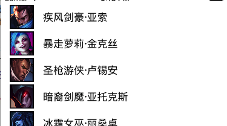
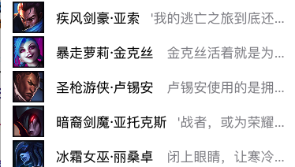
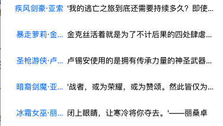
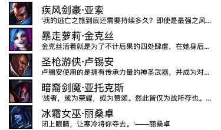

# TableView

- 首先它继承自`UIScrollView`,拥有scrollView的所有属性和方法

- 如何显示数据
    - `设置dateSourse数据源`
    - 数据源要遵守`UITableViewDataSource`协议
    - 数据源要实现协议中的某些方法
    - tableView有2种显示方式, 多组或者单组
        - `Style`
            - `Plain` 单个,单色
                - 标题会停留
            - `Grouped` 分组的
                - 标题不会停留
    - 可以设置cell的高度在标尺属性或者通过代码

- `<UITableViewDataSource>`

```objc

/**
 *  1 告诉tableView一共有多少组数据
 */
- (NSInteger)numberOfSectionsInTableView:(UITableView *)tableView

/**
 *  2 告诉tableView第section组有多少行
 */
- (NSInteger)tableView:(UITableView *)tableView numberOfRowsInSection:(NSInteger)section

/**
 *  3 告诉tableView第indexPath行显示怎样的cell
 */
- (UITableViewCell *)tableView:(UITableView *)tableView cellForRowAtIndexPath:(NSIndexPath *)indexPath

/**
 *  4 告诉tableView第section组的头部标题- 注意会自动将小写转换为**大写**
 */
- (NSString *)tableView:(UITableView *)tableView titleForHeaderInSection:(NSInteger)section

/**
 *  5 告诉tableView第section组的尾部标题
 */
- (NSString *)tableView:(UITableView *)tableView titleForFooterInSection:(NSInteger)section


/**
 *  6.设置tableView右侧导航条
 */
- (NSArray<NSString *> *)sectionIndexTitlesForTableView:(UITableView *)tableView{
    return [self.groupList valueForKey:@"title"];
}

```

# `cell的类型`

---
typedef NS_ENUM(NSInteger, UITableViewCellStyle) {
- `UITableViewCellStyleDefault`
    - Simple cell with text label and optional image view (behavior of UITableViewCell in iPhoneOS 2.x)
     
---
- `UITableViewCellStyleValue1`
    -  Left aligned label on left and right aligned label on right with blue text (Used in Settings)
    
---
- `UITableViewCellStyleValue2`
    - Right aligned label on left with blue text and left aligned label on right (Used in Phone/Contacts)
    
---
- `UITableViewCellStyleSubtitle`
    - Left aligned label on top and left aligned label on bottom with gray text (Used in iPod).
    
};
---


###  `cell`的设置代码


```objc

/** 某一组的某个cell 的添加, 内容 */
- (UITableViewCell *)tableView:(UITableView *)tableView cellForRowAtIndexPath:(NSIndexPath *)indexPath
{
    /** cell 的显示类型 */
    UITableViewCell *cell = [[UITableViewCell alloc] initWithStyle:UITableViewCellStyleSubtitle reuseIdentifier:nil];

    LMJHero *hero = self.heroes[indexPath.row];
    // 图片属性
    cell.imageView.image = [UIImage imageNamed:hero.icon];
    // 主文字属性
    cell.textLabel.text = hero.name;
    // 详细介绍的属性
    cell.detailTextLabel.text = hero.intro;
    return cell;
}

```


---

## `tableView`里边的模型的使用实例
---

# `.h`

```objc

@interface LMJCar : NSObject
/** 名字 */
@property (nonatomic, copy) NSString *name;
/** 图片名字 */
@property (nonatomic, copy) NSString *icon;

+ (instancetype)carWithName:(NSString *)name andIconName:(NSString *)icon;
@end


---

#import <Foundation/Foundation.h>

@class LMJCar;
@interface LMJCarGroup : NSObject
/** 头标题 */
@property (nonatomic, copy) NSString *header;


/** car数组 */
@property (nonatomic, strong) NSArray<LMJCar *> *cars;

/** 尾部标题 */
@property (nonatomic, copy) NSString *footer;

+ (instancetype)carGroupWithHeader:(NSString *)header andFooter:(NSString *)footer andCars:(NSArray<LMJCar *> *)cars;

@end

```

---
# `.m`
---

```objc

#import "ViewController.h"
#import "LMJCar.h"
#import "LMJCarGroup.h"
@interface ViewController () <UITableViewDataSource>
@property (weak, nonatomic) IBOutlet UITableView *tableView;
/** 汽车 "组" 的数组 */
@property (nonatomic, strong) NSArray<LMJCarGroup *> *carGroups;
@end

@implementation ViewController

- (NSArray<LMJCarGroup *> *)carGroups
{
    if(_carGroups == nil)
    {
        LMJCarGroup *group0 = [LMJCarGroup carGroupWithHeader:@"德系车" andFooter:@"外国的车车车子子自知I帧子在" andCars:nil];
        group0.cars = @[
            [LMJCar carWithName:@"奔驰" andIconName:@"m_2_100"],
            [LMJCar carWithName:@"宝马" andIconName:@"m_3_100"],
            [LMJCar carWithName:@"奥迪" andIconName:@"m_9_100"],
            [LMJCar carWithName:@"奔驰" andIconName:@"m_2_100"],
            [LMJCar carWithName:@"宝马" andIconName:@"m_3_100"],
            [LMJCar carWithName:@"奥迪" andIconName:@"m_9_100"]
                        ];


        LMJCarGroup *group1 = [LMJCarGroup carGroupWithHeader:@"日系车" andFooter:@"japan的车子6666" andCars:@[
[LMJCar carWithName:@"奔驰" andIconName:@"m_2_100"],
[LMJCar carWithName:@"宝马" andIconName:@"m_3_100"],
[LMJCar carWithName:@"奥迪" andIconName:@"m_9_100"]
]];

        LMJCarGroup *group2 = [LMJCarGroup carGroupWithHeader:@"天朝车" andFooter:@"chaina88888" andCars:@[
        [LMJCar carWithName:@"奔驰" andIconName:@"m_2_100"],
        [LMJCar carWithName:@"宝马" andIconName:@"m_3_100"],
        [LMJCar carWithName:@"奥迪" andIconName:@"m_9_100"],
        [LMJCar carWithName:@"奔驰" andIconName:@"m_2_100"],
                            ]];

        self.carGroups = @[group0, group1, group2];

    }
    return _carGroups;
}
- (void)viewDidLoad {
    [super viewDidLoad];

    self.tableView.dataSource = self;
}

/** tableView会主动获取数据源的这个方法,知道自己分几组
 * 这个方法是以number开头
 */
- (NSInteger)numberOfSectionsInTableView:(UITableView *)tableView
{
    return self.carGroups.count;
}

/** tableView会主动调用数据源的这个方法,知道自己第section组里边有多少个cell */
- (NSInteger)tableView:(UITableView *)tableView numberOfRowsInSection:(NSInteger)section
{
    return self.carGroups[section].cars.count;
}

/**
 *  tableView会调用数据源的   这个方法
 *
 *  @param tableView 哪个tableView调用了这个方法
 *  @param indexPath  应该创建cell的位置
 *
 *  @return 返回创建的cell
 */
- (UITableViewCell *)tableView:(UITableView *)tableView cellForRowAtIndexPath:(NSIndexPath *)indexPath
{
    UITableViewCell *cell = [[UITableViewCell alloc] init];
    LMJCar *car = self.carGroups[indexPath.section].cars[indexPath.row];
    cell.imageView.image = [UIImage imageNamed:car.icon];
    cell.textLabel.text = car.name;
    return cell;
}

/** tableView获取每一组头标题 */
- (NSString *)tableView:(UITableView *)tableView titleForHeaderInSection:(NSInteger)section
{
    return self.carGroups[section].header;
}

/** tableView获取每一组尾部的文字 */
- (NSString *)tableView:(UITableView *)tableView titleForFooterInSection:(NSInteger)section
{
    return self.carGroups[section].footer;
}


@end

```


