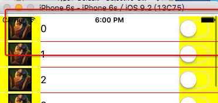
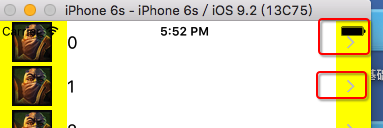
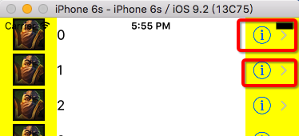
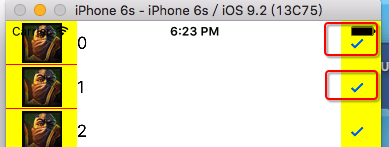
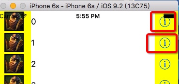
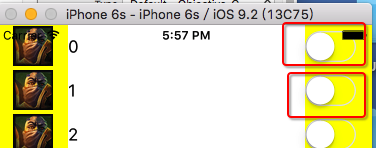

#  `Cell settings intro`

- 1> cell的注意点,cell可以设置背景色, cell.contentView也可以设置背景色
    - 在自定义cell-Style情况下, 添加` cell.textLabel.text`文字, 显示的背景色是cell的背景色
        - `textLabel`的`frame = (16 0; 344 43.5)`, 占据contentView的绝大部分
    - 在系统Style情况下, 添加`cell.textLabel.text`文字, 显示的背景色是cell.contentView的背景色
        - `textLabel`的`frame = (16 6; 87.5 19.5)`, 占据contentView的小部分

- 2>


# `示例图片和代码`
- 添加一个View来充当分割线:alpha = 0.2


```objc

@implementation LMJDealTableViewController

- (void)viewDidLoad {
    [super viewDidLoad];
    // 分割线从头像后边开始,很难看
    self.tableView.separatorColor = [UIColor redColor];
```
-

-
```objc
    // 隐藏分割线
    self.tableView.separatorStyle = UITableViewCellSeparatorStyleNone;
    /*
     typedef NS_ENUM(NSInteger, UITableViewCellSeparatorStyle) {
     UITableViewCellSeparatorStyleNone,
     UITableViewCellSeparatorStyleSingleLine,
     UITableViewCellSeparatorStyleSingleLineEtched   // This separator style is only supported for grouped style table views currently
     }
     */
}
```
```objc
/** dataSource */
#pragma mark - dataSource
// 每一组有多少行
- (NSInteger)tableView:(UITableView *)tableView numberOfRowsInSection:(NSInteger)section
{
    return 80;
}

// 每一个cell怎么显示
- (UITableViewCell *)tableView:(UITableView *)tableView cellForRowAtIndexPath:(NSIndexPath *)indexPath
{
    static NSString *ID = @"cell";
    UITableViewCell *cell = [tableView dequeueReusableCellWithIdentifier:ID];
    // 自带的textLabel,会遮挡住在LMJDealTableViewController里边添加的控件分割线View
    cell.textLabel.text = [NSString stringWithFormat:@"%zd", indexPath.row];
```
-
    
-
```objc
    cell.imageView.image = [UIImage imageNamed:@"173890255948"];
    //取消选中的样式变化
//    cell.selectionStyle = UITableViewCellSelectionStyleNone;
    /*
     typedef NS_ENUM(NSInteger, UITableViewCellSelectionStyle) {
     UITableViewCellSelectionStyleNone,
     UITableViewCellSelectionStyleBlue,
     UITableViewCellSelectionStyleGray,
     UITableViewCellSelectionStyleDefault NS_ENUM_AVAILABLE_IOS(7_0)
     };
     */
    // 设置`选中`的背景View, 背景View可以设置颜色哦
    UIView *selectedBackgroundView = [[UIView alloc] init];
    selectedBackgroundView.backgroundColor = [UIColor blueColor];
    cell.selectedBackgroundView = selectedBackgroundView;

    // 设置cell默认的背景颜色
//    cell.backgroundColor = [UIColor yellowColor];
```

```objc
    // 设置默认的背景View, 比设置cell默认的背景颜色优先级`高`, 比设置cell.contentView的背景色`低`
    // 无论是否设置textLabel,imageView
    UIView *backgroundView = [[UIView alloc] init];
    backgroundView.backgroundColor = [UIColor yellowColor];
    ;
    cell.backgroundView = backgroundView;
```
```objc

    //设置后边的附加的指示器, 在下边的图片里边的样式
//    cell.accessoryType = UITableViewCellAccessoryDetailButton;
```
    /*
     typedef NS_ENUM(NSInteger, `UITableViewCellAccessoryType`) {
`UITableViewCellAccessoryNone,   // don't show any accessory view`

`UITableViewCellAccessoryDisclosureIndicator, (揭露的事实)//regular chevron. doesn't track`

`UITableViewCellAccessoryDetailDisclosureButton __TVOS_PROHIBITED,// info button w/ chevron. tracks`

`UITableViewCellAccessoryCheckmark, // checkmark. doesn't track`

`UITableViewCellAccessoryDetailButton NS_ENUM_AVAILABLE_IOS(7_0)  __TVOS_PROHIBITED // info butto`

     };
---
   //自定义附加的View在右边<br>
    <br>
   //会遮挡住在LMJDealTableViewController里边添加的控件,比如说分割线View<br>
   <br>
```objc
    cell.accessoryView = [[UISwitch alloc] init];


    return cell;
}

/** tableViewDelegate */
#pragma mark - tableViewDelegate
// 选中某一行的时候调用
- (void)tableView:(UITableView *)tableView didSelectRowAtIndexPath:(NSIndexPath *)indexPath
{
    NSLog(@"cell = %@", indexPath);
}
@end
```
