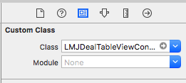

# `TableViewController`

- 一定要设置TableViewController自定义(Custom)的Class<br>
 

## tableView性能优化 - cell的循环利用方式3<br>

| 第一种方式 | 手动创建 | `if(cell==nil)` |
| -- | -- | -- |
| 第二种方式 | 手动注册 | `regiterClass` |
| 第三种方式 | storyboard<br>设置cell-ID<br>系统帮助注册 | 1一个cell-ID<br>2二个cell-ID<br>`在代码中直接根据ID拿到对应的cell` |

- 在storyboard中设置UITableView的Dynamic Prototypes Cell


- 设置cell的重用标识<br>


- 在代码中利用重用标识获取cell

```objc
// 0.重用标识
// 被static修饰的局部变量：只会初始化一次，在整个程序运行过程中，只有一份内存
static NSString *ID = @"cell";

// 1.先根据cell的标识去缓存池中查找可循环利用的cell
UITableViewCell *cell = [tableView dequeueReusableCellWithIdentifier:ID];

// 2.覆盖数据
cell.textLabel.text = [NSString stringWithFormat:@"cell - %zd", indexPath.row];

return cell;
```

- 在`TableViewController` 里边添加的cell,tableViewController里边的tableView会自动注册添加进控制器中的cell 的ID<br>
```objc
[self.tableView registerClass:[UITableViewCell class] forCellReuseIdentifier:ID]
```
    - 如果没有,TableViewController里边的tableView会自动调用下边的代码帮我们创建对应ID的cell<br>

        ```objc
 UITableViewCell *cell = [[UITableViewCell alloc] initWithStyle:UITableViewCellStyleDefault reuseIdentifier:ID]

        ```


-  TableViewController里边的tableView有多个cell,并且标识不一样,可以自定义cell的拿出方法<br>

```objc
    - (UITableViewCell *)tableView:(UITableView *)tableView cellForRowAtIndexPath:(NSIndexPath *)indexPath
{
    if (indexPath.row % 2 == 0) {
        return [self cell:tableView indexPath:indexPath];
    } else {
        return [self cell2:tableView indexPath:indexPath];
    }
}
#pragma mark - 创建、设置cell
- (UITableViewCell *)cell:(UITableView *)tableView indexPath:(NSIndexPath *)indexPath
{
    // 0.重用标识
    // 被static修饰的局部变量：只会初始化一次，在整个程序运行过程中，只有一份内存
    static NSString *ID = @"cell";

    // 1.先根据cell的标识去缓存池中查找可循环利用的cell
    UITableViewCell *cell = [tableView dequeueReusableCellWithIdentifier:ID];

    // 2.覆盖数据
    cell.textLabel.text = [NSString stringWithFormat:@"cell - %zd", indexPath.row];

    return cell;
}
- (UITableViewCell *)cell2:(UITableView *)tableView indexPath:(NSIndexPath *)indexPath
{
    // 0.重用标识
    // 被static修饰的局部变量：只会初始化一次，在整个程序运行过程中，只有一份内存
    static NSString *ID = @"cell2";

    // 1.先根据cell的标识去缓存池中查找可循环利用的cell
    UITableViewCell *cell = [tableView dequeueReusableCellWithIdentifier:ID];

    // 2.覆盖数据
    cell.textLabel.text = [NSString stringWithFormat:@"cell2 - %zd", indexPath.row];
    return cell;
}

```

