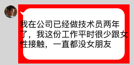
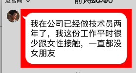
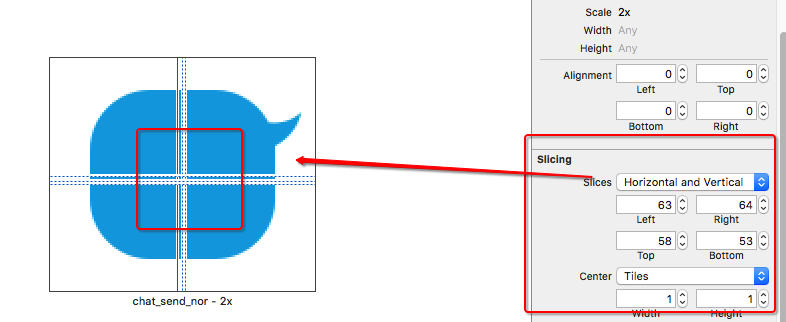

# Button


- 可以设置不同状态下的文字,背景图片
    -storyboard默认是普通状态下的文字显示状态,和图片显示状态

```objc
- (UIButton *)addButtonWithNormalImage:(NSString *)normalImage highlightedImage:(NSString *)highlightedImage  disabledImage:(NSString *)disabledImage frame:(CGRect)frame addTarget:(id)target action:(SEL)action addToWhichSuperview:(UIView *)superview
{
    UIButton *btn = [[UIButton alloc] init];
    btn.frame = frame;
    // 设置不同状态下的图片显示
    [btn setBackgroundImage:[UIImage imageNamed:normalImage] forState:UIControlStateNormal];
    [btn setBackgroundImage:[UIImage imageNamed:highlightedImage] forState:UIControlStateHighlighted];
    [btn setBackgroundImage:[UIImage imageNamed:disabledImage] forState:UIControlStateDisabled];

    // 添加控制器 --监听方法
    [btn addTarget:target action:action forControlEvents:UIControlEventTouchUpInside];

    // 添加到哪一个父控件
    [superview addSubview:btn];
    return btn;
}
```


- 注意一下获取按钮文字的请区别

    ```objc

    //1.获取被点击按钮的文字
    NSString *optionStr = [optionButton titleForState:UIControlStateNormal];

    //2.只有getter方法
      NSString *optionStr = answerButton.currentTitle
    ```

- button有多种种系统的样式

```objc
typedef NS_ENUM(NSInteger, UIButtonType) {
    UIButtonTypeCustom = 0,                         // no button type
    UIButtonTypeSystem NS_ENUM_AVAILABLE_IOS(7_0),  // standard system button

    UIButtonTypeDetailDisclosure,
    UIButtonTypeInfoLight,
    UIButtonTypeInfoDark,
    UIButtonTypeContactAdd,

    UIButtonTypeRoundedRect = UIButtonTypeSystem,   // Deprecated, use UIButtonTypeSystem instead
};

```

---
#### 设置一个`QQ聊天内容按钮控件`的步骤(frame)
- 1.创建按钮控件,设置字体, 字体颜色, 自动换行属性<br>

```objc
        //创建并添加聊天内容控件
        UIButton *textButton = [[UIButton alloc]init];
        [self.contentView addSubview:textButton];

        textButton.titleLabel.font = [UIFont systemFontOfSize:17];

        [textButton setTitleColor:[UIColor blackColor] forState:UIControlStateNormal];

        //设置按钮里的标签行数0，即自动换行
        textButton.titleLabel.numberOfLines = 0;
```

 - 2.为按钮里边的文字设置一个`边界`,相当于让文字居中,<br>
    - 加和不加的区别
    - 
    ---
    - 
 ```objc
        textButton.titleEdgeInsets = UIEdgeInsetsMake(10, 10, 10, 10);
        self.textButton = textButton;
 ```

 - 3.根据文字的内容多少算出按钮的size<br>

````objc

  boundingRectWithSize:(CGSize)size options:(NSStringDrawingOptions)options
  attributes:(nullable NSDictionary<NSString *, id> *)attributes
  context:(nullable NSStringDrawingContext *)context

    //根据文字内容计算文字的大小
     CGSize boundSize =
     [model.text boundingRectWithSize:CGSizeMake(200, CGFLOAT_MAX)
     options:NSStringDrawingUsesLineFragmentOrigin
    attributes:@{NSFontAttributeName : [UIFont systemFontOfSize:17]} context:nil].size

    //计算聊天控件的大小
    CGSize textSize = CGSizeMake(boundSize.width + 40, boundSize.height + 40);

    CGFloat textX = 0;
    if (model.type == kMessageMe) {  //如果是自己发的消息
        textX = iconX - textSize.width;
    }else{
        textX = CGRectGetMaxX(_iconFrame);
    }
    CGFloat textY = iconY;

//    _textFrame = CGRectMake(textX, textY, textSize.width, textSize.height);
    _textFrame = (CGRect){{textX,textY},textSize};

 ````


- 3.按钮里边设置图片的时候怎么进行图片拉伸

   -  1. 方法一. 设置图片的时候设置图片对象的缩放范围方法,生成一个新的图片

```objc

    UIImage *image = [UIImage imageNamed:@"chat_send_nor"];

    //1.设置缩放的范围
    // UIImageResizingModeTile 平铺
    //UIImageResizingModeStrech 拉伸
   image = [image resizableImageWithCapInsets:
            UIEdgeInsetsMake(image.size.height / 2, image.size.width / 2,
            image.size.height / 2, image.size.width / 2)
            resizingMode:UIImageResizingModeTile];
        [self.textButton setBackgroundImage:image
                            forState:UIControlStateNormal];

    // 2.或者
    image = [image stretchableImageWithLeftCapWidth:image.size.width * 0.5 topCapHeight:image.size.height * 0.5];

    // left
    // top
    // width
    // height

    // right = width - left - 1;
    // 1 = width - left - right;
    // bottom = height - top - 1;
    // 1 = height - top - bottom;

```

    - 2. 方法二.直接在图片属性里边设置




## `按钮的内部结构`

```objc


//- (CGRect)imageRectForContentRect:(CGRect)contentRect
//{
//    return CGRectMake(0, 0, contentRect.size.width, contentRect.size.height);
//}
//
//- (CGRect)titleRectForContentRect:(CGRect)contentRect
//{
//    return CGRectMake(0, 30, 70, 30);
//}

- (void)layoutSubviews
{
    [super layoutSubviews];

    CGFloat buttonW = self.frame.size.width;
    CGFloat buttonH = self.frame.size.height;

    CGFloat imageH = buttonW - 10;
    self.imageView.frame = CGRectMake(0, 0, buttonW, imageH);

    self.titleLabel.frame = CGRectMake(0, imageH, buttonW, buttonH - imageH);
}

```
