# UIDynamic

- 1, 创建物理仿真器
    - 礼拜呢的referenceView, 是参照视图, 其实就是设置仿真范围

```objc

/** 物理仿真器 */
@property (nonatomic, strong) UIDynamicAnimator *animator;

- (UIDynamicAnimator *)animator
{
    if (!_animator) {
        // 创建物理仿真器(ReferenceView, 参照视图, 其实就是设置仿真范围)
        _animator = [[UIDynamicAnimator alloc] initWithReferenceView:self.view];
    }
    return _animator;
}

```

- 2, 重力行为

```objc

    // 1.创建物理仿真行为 - 重力行为
    UIGravityBehavior *gravity = [[UIGravityBehavior alloc] init];
    [gravity addItem:self.blueView];
    // 重力方向
    //    gravity.gravityDirection = CGVectorMake(100, 100);
    // 重力加速度()
    gravity.magnitude = 10;
    // 100 point/s²
    // 移动的距离 = 1/2 * magnitude * 时间²

    // 2.添加 物理仿真行为 到 物理仿真器 中, 开始物理仿真
    [self.animator addBehavior:gravity];

```

- 3, 碰撞行为

```objc

    // 1.创建 碰撞行为
    UICollisionBehavior *collision = [[UICollisionBehavior alloc] init];

    // 让参照视图的bounds变为碰撞检测的边框
    collision.translatesReferenceBoundsIntoBoundary = YES;
    [collision addItem:self.blueView];
    [collision addItem:self.segmentControl];

    // 2.创建物理仿真行为 - 重力行为
    UIGravityBehavior *gravity = [[UIGravityBehavior alloc] init];
    gravity.magnitude = 100;
    [gravity addItem:self.blueView];

    // 3.添加行为
    [self.animator addBehavior:collision];
    [self.animator addBehavior:gravity];

```


- 4, 添加边界的碰撞行为

```objc
    // 1.创建 碰撞行为
    UICollisionBehavior *collision = [[UICollisionBehavior alloc] init];
    [collision addItem:self.blueView];


    // 添加边界1
    //    CGFloat startX = 0;
    //    CGFloat startY = self.view.frame.size.height * 0.5;
    //    CGFloat endX = self.view.frame.size.width;
    //    CGFloat endY = self.view.frame.size.height;
    //    [collision addBoundaryWithIdentifier:@"line1" fromPoint:CGPointMake(startX, startY) toPoint:CGPointMake(endX, endY)];
    //    [collision addBoundaryWithIdentifier:@"line2" fromPoint:CGPointMake(endX, 0) toPoint:CGPointMake(endX, endY)];

    // 添加边界2
    CGFloat width = self.view.frame.size.width;
    UIBezierPath *path = [UIBezierPath bezierPathWithOvalInRect:CGRectMake(0, 0, width, width)];
    [collision addBoundaryWithIdentifier:@"circle" forPath:path];

    // 2.创建物理仿真行为 - 重力行为
    UIGravityBehavior *gravity = [[UIGravityBehavior alloc] init];
    gravity.magnitude = 10;
    [gravity addItem:self.blueView];

    // 3.添加行为
    [self.animator addBehavior:collision];
    [self.animator addBehavior:gravity];

```

- 4, 吸附行为, **记得要移除之前的吸附行为 [self.animator removeAllBehaviors];**
    - 如果要进行连续的捕捉行为，需要先把前面的捕捉行为从物理仿真器中移除

```objc


    // 获得触摸点
    UITouch *touch = [touches anyObject];
    CGPoint point = [touch locationInView:self.view];

    // 创建吸附\捕捉行为
    UISnapBehavior *snap = [[UISnapBehavior alloc] initWithItem:self.blueView snapToPoint:point];
    // 防抖系数(值越小, 越抖)
    snap.damping = 1.0;

    // 添加行为
    [self.animator removeAllBehaviors];
    [self.animator addBehavior:snap];

```


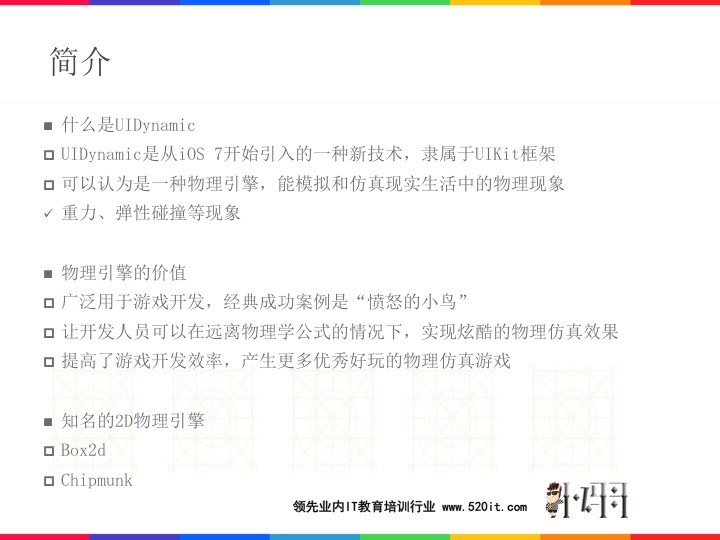

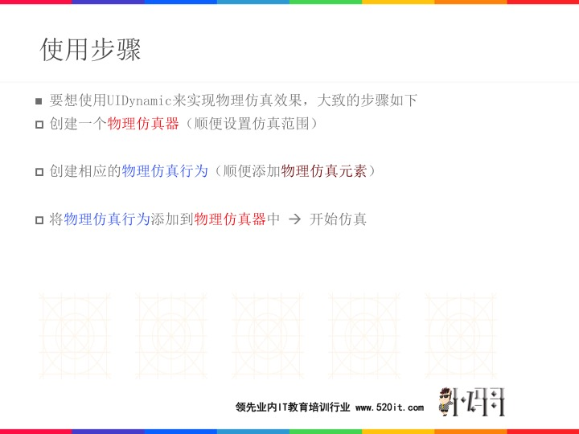

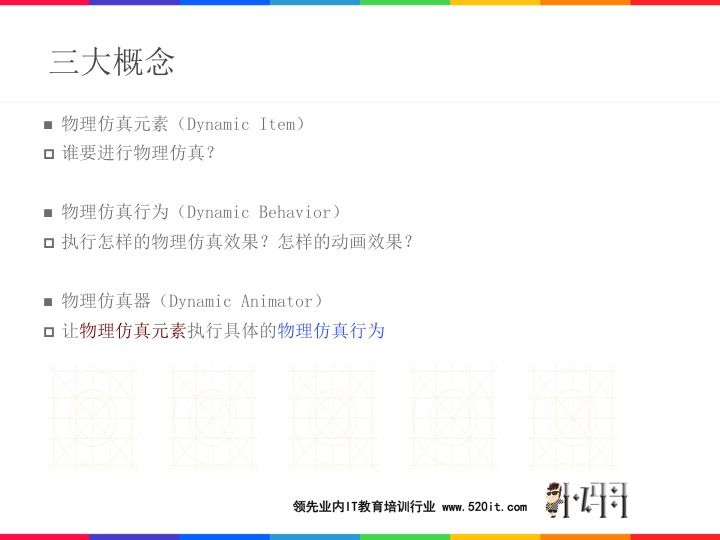

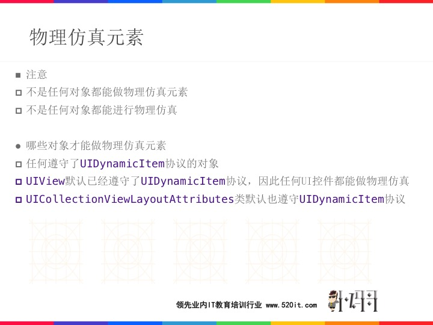

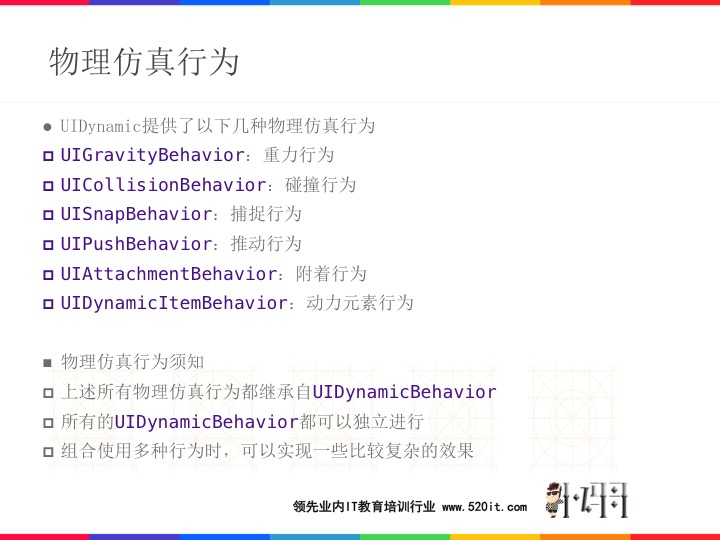

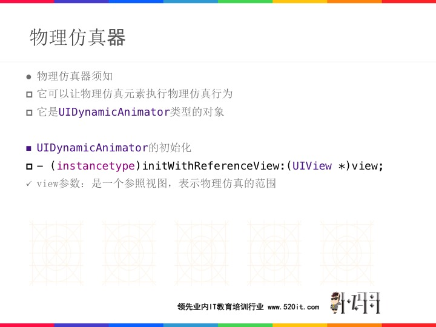

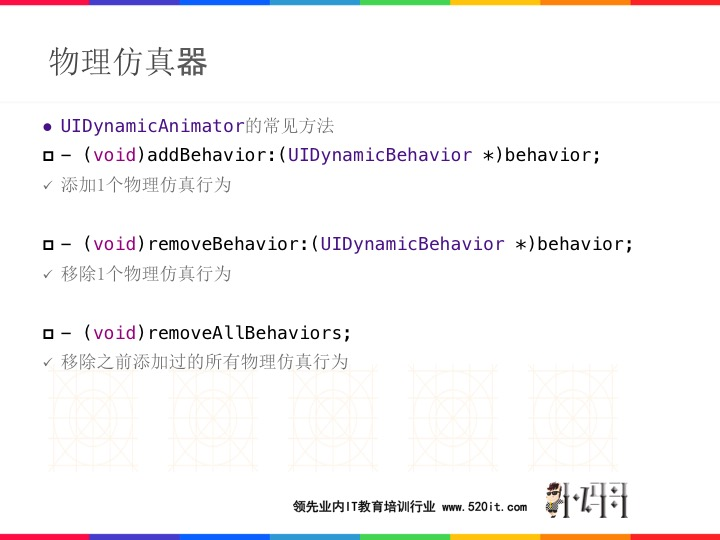

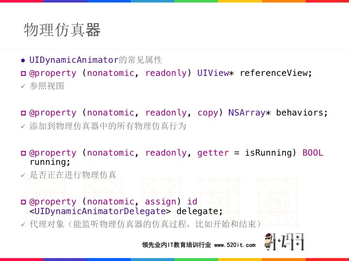

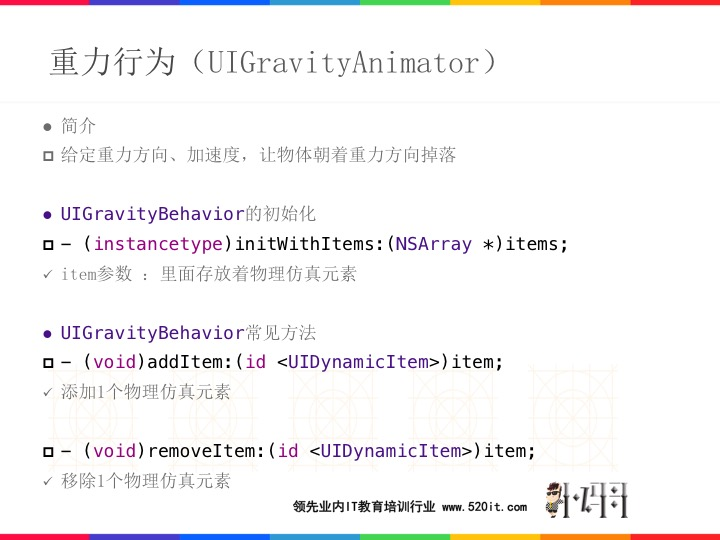

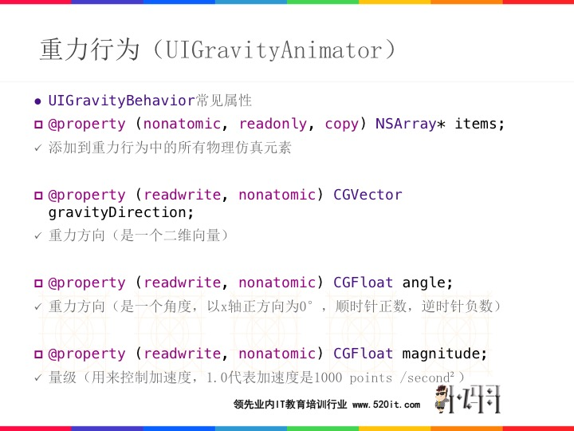

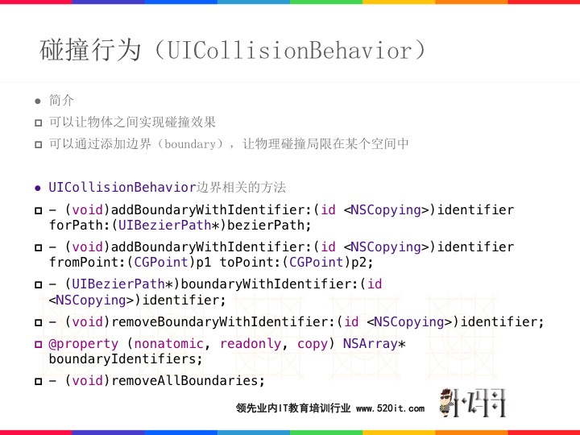

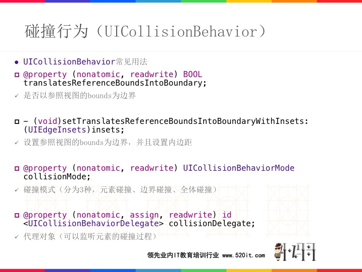

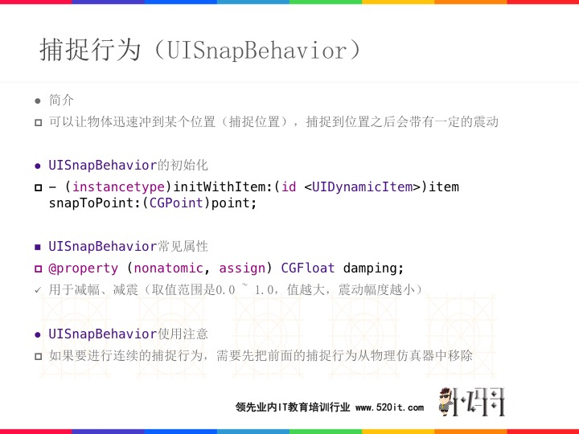
